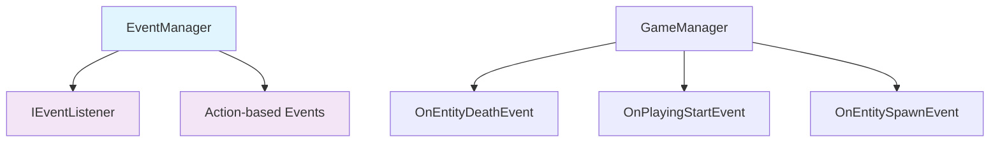
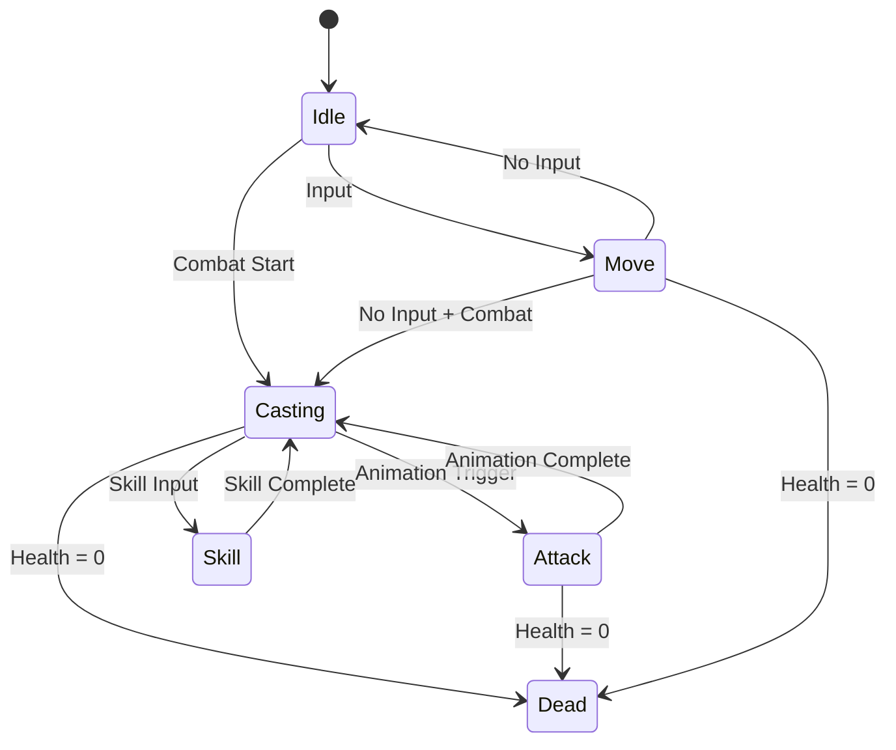
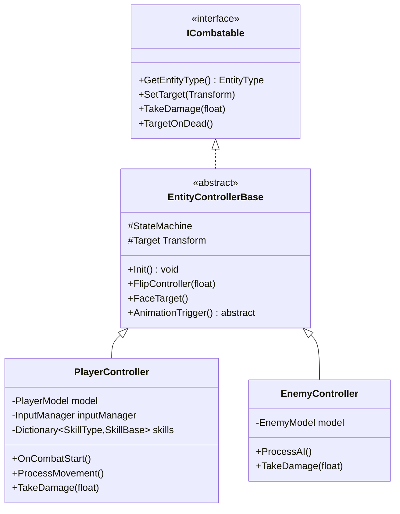
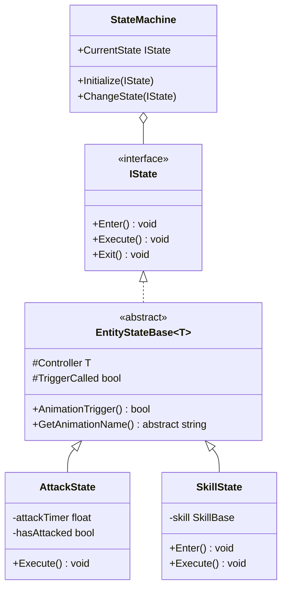

# ArcherOfGod - Unity 게임 개발 포트폴리오

## 📋 프로젝트 개요
2D 아처 액션 게임으로, 플레이어가 궁수가 되어 적과 전투하는 게임입니다. 이 프로젝트는 **객체지향 설계 원칙과 다양한 디자인 패턴을 활용**하여 확장성과 유지보수성이 뛰어난 아키텍처를 구현하는 것에 중점을 두었습니다.

## 🏗️ 아키텍처 설계

### 1. MVC 패턴 (Model-View-Controller)
프로젝트의 핵심 아키텍처로 MVC 패턴을 채택하여 관심사를 분리했습니다.

```
📁 MVC/
├── 📁 Data/           # Model Layer
│   ├── PlayerModel.cs
│   ├── EnemyModel.cs
│   └── CopyCatModel.cs
├── 📁 Controller/     # Controller Layer
│   ├── Player/
│   ├── Enemy/
│   ├── CopyCat/
│   └── Game/
└── 📁 View/          # View Layer (Unity UI Components)
    └── UI/
```

**핵심 특징:**
- **Model**: 게임 데이터와 비즈니스 로직 담당 (`Assets/Scripts/MVC/Data/PlayerModel.cs:1`)
- **Controller**: 사용자 입력과 게임 로직 제어 (`Assets/Scripts/MVC/Controller/Player/PlayerController.cs:1`)
- **View**: UI 표현과 사용자 상호작용 담당

### 2. 계층형 이벤트 시스템 (Observer Pattern)
타입 안전성과 성능을 고려한 계층형 이벤트 시스템을 구현했습니다.



**특징** (`Assets/Scripts/Util/EventSystem.cs:1`):
- **타입 안전성**: 제네릭 기반 이벤트 타입 시스템
- **에러 처리**: try-catch를 통한 안전한 이벤트 핸들링
- **체이닝 지원**: EventChain을 통한 이벤트 전파 제어
- **메모리 관리**: 자동 구독 해제 및 빈 리스트 정리

## 🎨 적용된 디자인 패턴

### 1. Singleton Pattern
게임 전반에 걸쳐 사용되는 매니저 클래스들에 적용했습니다.

```csharp
public class GameManager : Singleton<GameManager>
{
    // Thread-safe lazy initialization
    // DontDestroyOnLoad 자동 처리
}
```

**구현 특징** (`Assets/Scripts/Util/Singleton.cs:1`):
- **Thread-safe**: 멀티스레드 환경에서 안전
- **Lazy Initialization**: 필요할 때만 인스턴스 생성
- **Unity 생명주기 통합**: DontDestroyOnLoad 자동 적용

### 2. State Pattern (FSM)
캐릭터의 복잡한 상태 관리를 위해 상태 패턴을 구현했습니다.



**핵심 구현** (`Assets/Scripts/MVC/Controller/StateMachine.cs:1`):
- **IState Interface**: 일관된 상태 인터페이스
- **상태 전환**: 안전한 Enter/Exit 처리
- **애니메이션 연동**: Unity Animator와 완벽 통합

### 3. Strategy Pattern
스킬 시스템에서 각기 다른 스킬 동작을 캡슐화했습니다.

```csharp
public abstract class SkillBase : MonoBehaviour
{
    public abstract UniTask SkillTask(CancellationToken cancellationToken);
    // 각 스킬이 고유한 실행 로직을 구현
}
```

**특징** (`Assets/Scripts/Component/Skill/SkillBase.cs:1`):
- **비동기 실행**: UniTask를 활용한 성능 최적화
- **취소 토큰**: 스킬 중단 메커니즘
- **오브젝트 풀링**: 메모리 효율성 개선

### 4. Observer Pattern (Events)
게임 내 각종 이벤트를 느슨하게 결합된 방식으로 처리합니다.

```csharp
// 이벤트 정의
public struct OnEntityDeathEvent : IEvent
{
    public readonly EntityType Type;
}

// 구독 및 발행
EventManager.Subscribe<OnEntityDeathEvent>(HandleEntityDeath);
EventManager.Publish(new OnEntityDeathEvent(EntityType.Player));
```

### 5. Command Pattern
공격 시스템에서 명령 객체를 통해 실행 로직을 캡슐화했습니다.

```csharp
shotArrow.Attack(new ShotArrowCommand(
    damage: attack,
    duration: arrowSpeed,
    startPoint: (Vector2)transform.position + firePointOffset,
    endPoint: Target
));
```

## 🔧 기술적 구현 세부사항

### 1. 성능 최적화
- **Object Pooling**: 화살 및 이펙트 객체 재사용 (`Assets/Scripts/Component/Skill/SkillBase.cs:77`)
- **UniTask 활용**: GC Allocation 최소화한 비동기 처리
- **조건부 업데이트**: 불필요한 Update() 호출 최소화

### 2. Unity 엔진 숙련도
- **컴포넌트 시스템**: MonoBehaviour와 인터페이스의 효과적 조합
- **애니메이션 통합**: Animator 파라미터를 통한 상태 동기화
- **물리 시스템**: Rigidbody2D를 활용한 부드러운 움직임

### 3. 에러 처리 및 안정성
- **Debug.Assert**: 개발 단계 런타임 검증
- **Null 체크**: 안전한 참조 접근
- **예외 처리**: 이벤트 시스템에서 안전한 에러 핸들링

## 📊 클래스 다이어그램

### Entity 계층 구조


### 상태 시스템 구조


## 🎯 기술적 성과

### 1. 확장성
- **새로운 스킬 추가**: SkillBase 상속으로 간단한 확장
- **새로운 엔티티 추가**: EntityControllerBase 기반 일관된 구조
- **이벤트 시스템**: 새로운 게임 이벤트 타입 손쉬운 추가

### 2. 유지보수성
- **관심사 분리**: MVC 패턴으로 명확한 책임 분배
- **상태 캡슐화**: 각 상태별 독립적인 로직 관리
- **타입 안전성**: 컴파일 타임 에러 검출

### 3. 성능
- **메모리 최적화**: Object Pooling과 UniTask 활용
- **CPU 효율성**: 상태 패턴으로 조건문 최소화
- **GC 최소화**: struct 기반 이벤트와 값 타입 활용

## 🔍 코드 품질 지표

### SOLID 원칙 준수
- **S (SRP)**: 각 클래스는 단일 책임만 가짐
- **O (OCP)**: SkillBase, EntityStateBase 등 확장에 열려있음
- **L (LSP)**: 모든 상속 관계에서 부모 타입으로 대체 가능
- **I (ISP)**: IState, ICombatable 등 특화된 인터페이스
- **D (DIP)**: 추상화에 의존하는 구조

### 명명 규칙 및 가독성
- **일관된 네이밍**: Pascal Case, Camel Case 규칙 준수
- **의미있는 이름**: 변수와 메서드명에서 의도 명확히 표현
- **네임스페이스 구조**: 논리적 계층으로 코드 조직화

## 🚀 향후 개선 방향

1. **Unit Testing**: 핵심 로직에 대한 단위 테스트 추가
2. **Performance Profiling**: Unity Profiler를 통한 성능 최적화
3. **Save System**: JSON 기반 게임 데이터 저장 시스템
4. **Audio Manager**: 사운드 효과 관리 시스템 구축

---

이 프로젝트는 **객체지향 설계 원칙**과 **디자인 패턴**을 실제 게임 개발에 적용하여, 확장 가능하고 유지보수가 용이한 코드베이스를 구축하는 것을 목표로 했습니다. 특히 Unity 엔진의 특성을 고려한 **성능 최적화**와 **메모리 관리**에 중점을 두었습니다.